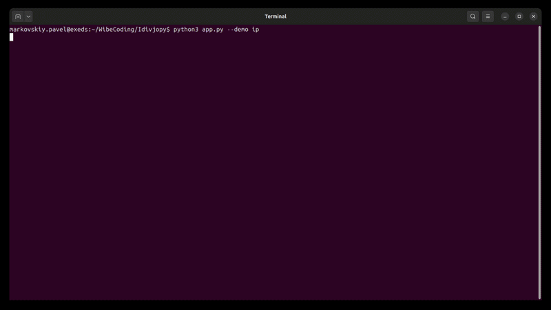

# IDvjPy — ID Variables & Joiner on Python

<p align="center">
  
</p>

<p align="center"><em>Define your variables, join your command.</em></p>

Keyboard-driven TUI that treats **tags as command templates** and assembles them into shell lines (`!tag[tid]`, `!!`). Python **3.12+**, [Textual](https://textual.textualize.io/).

**IDvjPy_term** v1.23 — умный терминал для создания командных строк из тегов.

## Что это?

IDvjPy — терминальное приложение (TUI) на Python (Textual) с клавиатурным управлением.
Постоянная тегированная история команд хранится в SQLite.

**Философия:** теги — переменные с шаблонами команд; приложение собирает их в сложные командные строки.

Код приложения лежит в `src/`. В рабочей папке — данные: `settings.yml`, база тегов, `.bashrc_term*`. При пустой БД в журнале показывается каталог seed-справочников (Linux, [цепочки k8s](K8S_CHAINS.md), git, ops), чтобы выбрать набор команд.

Запуск: `python3 app.py` (лаунчер; код в `src/`). Тесты: `python3 -m pytest tests/ -v`. Справка в приложении: `:?`.

## Возможности

- Персистентные теги и сборка команд (`!tag[tid]`, `!!`)
- Справочники команд (seed): Linux, [цепочки для расследования k8s](K8S_CHAINS.md), git, docker, helm и другие ops
- Журнал по блокам: фокус, сворачивание, пайп `|` из сфокусированного блока
- Автодополнение путей и команд из истории/БД
- Построчный режим в выводе блока (копирование и дописывание во ввод)
- JSON viewer (F5) с черновиком `jq` и `$JSON`
- Переменные `$VAR` (файлы `.bashrc_term` / `.bashrc_term_<instance>`); `$OUT` — последняя строка блока, только в момент команды
- Алиасы из `~/.bashrc` (в том числе `$1` / `$2` / `$@`), фоновое выполнение команд
- `> cmd` — настоящий TTY (htop, vim, ssh); клик и PgUp/PgDn активируют видимый блок журнала

## Установка

Нужен Python 3.12+.

```bash
./setup.sh                 # создаёт .venv и ставит зависимости
source .venv/bin/activate
# или: pip install -r requirements.txt
```

На Linux для буфера обмена нужны `xclip` или `xsel` (на Wayland — `wl-clipboard`).

Переменные: при первом старте копируется [`src/.bashrc_term.example`](src/.bashrc_term.example) в `.bashrc_term_<instance>`. Демо: [`DEMO.md`](DEMO.md) (живой сценарий) и `python3 app.py --demo` (автонабор для записи видео).

## Запуск

```bash
python3 app.py
python3 app.py --instance-name=user1   # отдельный .bashrc_term_user1 и history_user1.txt
python3 app.py --demo                  # автотур: печатает команды сам (Esc — стоп)
python3 app.py --demo ip               # myip → jq .cc → Wiki URL → hello pipe → echo Hello, $OUT
python3 app.py --demo full --demo-quit
```

Код приложения лежит в `src/`. В корне рабочей копии — данные: `settings.yml`, база тегов, `.bashrc_term*`, `history_<instance>.txt`. Seed-справочники: `python3 src/seed_git.py --seed` и т.п. (команды также показаны при первом старте, если БД пустая).

| Путь | Назначение |
|------|------------|
| `src/` | TUI, CSS, seed-скрипты, шаблон `.bashrc_term.example` |
| `app.py` / `backup_db.py` | лаунчеры (не правят данные) |
| `settings.yml`, `*.db`, `.bashrc_term*` | настройки, теги, переменные |

## Система префиксов

| Префикс | Назначение | Пример |
|---------|------------|--------|
| (нет) | Выполнить shell-команду | `ls -la` |
| `> cmd` | Отдать настоящий TTY (htop, vim, ssh) | `> htop` |
| `#tag cmd` | Сохранить команду с тегом (текст как есть) | `#deploy rsync -av src/ host:` |
| `# command` | В историю, не выполнять (как `# …` в bash; пробел после `#`) | `# curl https://example.com` |
| `#tag=` / `#tag=ID=` | Комментарий к тегу / команде | `#deploy=prod rsync` |
| `#tag+` / `#tag+ID` | Подставить на редактирование | `#deploy+1` |
| `#tag-` / `#tag-tid` | Мягкое удаление | `#deploy-` / `#deploy-1` |
| `#tag!` / `#tag!tid` | Восстановить после удаления | `#deploy!` / `#deploy!1` |
| `?` / `??` / `?tag` / `?tag[tid]` | Запрос тегов / всех / по тегу / превью | `?deploy` |
| `!tag[tid]` / `!N` | Вставить команду во ввод (не запускает) | `!deploy[1]` |
| `!! …` | Собрать строку во вводе | `!! deploy[1] && start[1]` |
| `:` | Команды приложения | `:q`, `:cd`, `:r`, `:/text`, `:export tag`, `:i`, `:?` |
| `\| cmd` | Пайп stdout сфокусированного блока (в историю, как обычная команда) | `\| grep error` |
| `$OUT` | По запросу: последняя непустая строка блока (не хранится) | `echo Hello, $OUT` |
| `$VAR=val` | Локальная переменная (пишет `.bashrc_term_<instance>`) | `$EDITOR=nvim` |

`!` и `!!` подставляют текст во ввод. Запуск — отдельным Enter.

Алиасы с `$1` / `$2` / `$@` подставляют аргументы (`alias klogin="tsh kube login $1"` → `klogin cluster` становится `tsh kube login cluster`). Без `$n` остаток строки по-прежнему дописывается к телу алиаса.

### Команды приложения (`:`)

- `:q` — выход
- `:w file` — записать вывод в файл
- `:h [N]` — последние N строк `history_<instance>.txt` одним блоком (по умолчанию из `settings.yml`; строки можно брать построчным режимом)
- `:h /text` — поиск по этому файлу в подсказках (без учёта регистра, свежие сверху, одинаковые строки один раз). Esc+Enter — тем же поиском в журнал
- `:c` — очистить блоки журнала
- `:json` / `:json <file>` — JSON viewer (последний блок или файл)
- `:i …` — Kubernetes Ingress Analyzer (`:i` без аргументов — справка)
- `:cd [path]` — показать / сменить рабочий каталог приложения (то же делает `cd path`)
- `:r` — команда сфокусированного блока во ввод
- `:/text` / `:g` / `:n` / `:N` — поиск по строкам журнала (с блока `/` открывает `:/`; `n`/`N` — следующее / предыдущее)
- `:export tag [file]` / `:import file` — один тег в JSON и обратно
- `:theme [name]` — тема TUI (`dark` / `light` / `nord` / …); пишется в `settings.yml`. Клавиша `d` — dark/light
- `:?` — эта справка внутри TUI

## Горячие клавиши

| Клавиша | Действие |
|---------|----------|
| `Tab` | Из ввода — на последний блок журнала (`:h`, `:?`, команда); если открыт список подсказок — применить кандидата |
| `Esc` | Фокус на ввод. В построчном режиме: сначала выключить режим, повторный Esc — во ввод |
| `↑` / `↓` | `history_<instance>.txt` (+ сессия) во вводе; набранный текст фильтрует совпадения; прокрутка журнала, если фокус на блоке |
| `PgUp` / `PgDn` | Прокрутка журнала на страницу; активным становится **видимый** блок (без прыжка к его началу). Из ввода — переход в просмотр |
| клик по блоку | Фокус на блоке без прокрутки к началу (`terminal_mouse: true`) |
| `Space` / `←` `→` | Свернуть / развернуть блок |
| `F3` | Копировать полный stdout блока |
| `Ctrl+C` | Скопировать всю строку ввода; если фокус на блоке журнала — весь блок (как F3) |
| `F5` | JSON viewer для сфокусированного (или последнего) блока |
| `F6` | Простой вывод (без Rich-тегов, удобнее выделять мышью) |
| `F2` | Построчный режим в блоке |
| `Shift+Insert` / `Ctrl+V` | Вставка во ввод (не затирает уже набранное). В построчном режиме `Ctrl+V` дописывает текущую строку |
| `Ctrl+D` | Очистить всю строку ввода |
| `d` | Тёмная / светлая тема (`textual-dark` / `textual-light`), сохраняется в `settings.yml`. Когда фокус во вводе, `d` печатается как буква; тема: фокус на журнале или `:theme` |

### Построчный режим (блок в фокусе)

По умолчанию выключен. Включить: `Tab`/`PgUp` на блок, затем `Enter` или `F2`.

| Клавиша | Действие |
|---------|----------|
| `↑` / `↓` | Строка вверх / вниз (на краю блока — снова скролл журнала) |
| `Home` / `End` | Первая / последняя строка |
| `Enter` | Скопировать строку (без конечных пробелов) и перейти во ввод, курсор в конец |
| `Shift+Enter` / `Ctrl+V` | Дописать строку во ввод через пробел, остаться в блоке |
| `Esc` / `F2` | Выключить режим |
| `/` | Начать поиск (`:/` во вводе) |
| `n` / `N` | Следующее / предыдущее совпадение |

Если `Shift+Enter` срабатывает как обычный Enter, терминал не отличает клавиши — используйте **Ctrl+V**. Пока фокус во вводе, `Ctrl+V` по-прежнему вставляет из буфера.

### JSON viewer

- `Enter` на узле: закрыть viewer, выставить `$JSON`, буфер обмена, черновик во вводе: `\| jq '.path'` (из блока) или `jq '.path'` (из файла).
- Пример: `jq $JSON test.json`.
- Поиск: `/` или поле вверху; `n` / `N` — следующее / предыдущее совпадение.

## Автодополнение

- Пути: `./` `../` `/` `~`, токен с `/`, `cd`/`pushd`, или аргумент не-флаг после команды.
- **Tab** для пути заменяет только текущий токен; полная команда из истории/БД — всю строку.
- Каталог с `/` (`ls ~/`) — первый кандидат сам каталог; Enter выполняет его, Tab не форсирует дочерний путь.
- Точное совпадение всей строки скрывает список, Enter выполняет команду.
- **Пробел в конце** (`ls` + пробел): список закрывается, Enter запускает набранное, а не более длинного кандидата (`ls -la`). Чтобы взять кандидата — Tab без завершающего пробела.
- **`!file` / `!kube`**: сразу по `!` список тегов (`[file, kube, log]`). Tab выбирает тег, затем команды: `<139> file[1]  ls -la`, во ввод — `!file[1]`. Сборка `#file !file[1] | !file[2]` с расшифровкой сверху списка.

## Конфигурация

[`settings.yml`](settings.yml):

```yaml
max_lines: 100000
history_lines: 20
database_tags_file: mytags.db
command_timeout: 10          # 0 = без таймаута
terminal_mouse: true         # клик выделяет блок; false — выделение текста ОС
theme: textual-dark          # `d` / `:theme`; сохраняется при смене
```

Переменные читаются из `.bashrc_term_<instance>` (приоритет) и `.bashrc_term` (дополняет). Формат: `export VAR=val` или `VAR=val`. Если файлов нет, при старте копируется [`src/.bashrc_term.example`](src/.bashrc_term.example).

Файл БД (`database_tags_file`, по умолчанию `mytags.db`) **не входит в git**. При первом запуске создаётся пустая SQLite-схема; в журнале появляется каталог seed-скриптов, чтобы выбрать набор команд. Каждый `--seed` можно ввести в том же TUI.

## Архитектура

- **`CommandRunner`** — приложение Textual
- **`JournalScroll`** — журнал: скролл клавишами активирует видимый блок
- **`CommandBlock`** / **`InfoBlock`** / **`QueryResultsBlock`** — блоки журнала
- **`LineNavigable`** — построчный курсор в блоке

Модули в [`src/`](src/): [`app.py`](src/app.py), [`database_v2.py`](src/database_v2.py), [`command_parser_v2.py`](src/command_parser_v2.py), [`json_viewer.py`](src/json_viewer.py), [`ingress_analyzer.py`](src/ingress_analyzer.py), [`app.css`](src/app.css). Корневой [`app.py`](app.py) только запускает TUI.

Подробности сессии и поведения: [`COMPACT_SUMMARY.md`](COMPACT_SUMMARY.md). Как читается БД: [`DATABASE.md`](DATABASE.md).

## Тесты

```bash
python3 -m pytest tests/ -v
```

## Справочники команд

Каждый сид перезаписывает **только свои** теги.

Цепочки для расследования k8s: [`K8S_CHAINS.md`](K8S_CHAINS.md). `python3 src/seed_k8s_chains.py --seed` (не трогает `proc` / `file` / `net` / `kube`).

| Скрипт | Документация | Теги |
|--------|--------------|------|
| `python3 src/seed_linux_commands.py --seed` | [`SEED_LINUX_COMMANDS.md`](SEED_LINUX_COMMANDS.md) | `proc` `file` `net` `kube` |
| `python3 src/seed_k8s_chains.py --seed` | [`K8S_CHAINS.md`](K8S_CHAINS.md) | `kpod` `klog` `kquota` … |
| `python3 src/seed_git.py --seed` | [`SEED_GIT_COMMANDS.md`](SEED_GIT_COMMANDS.md) | `git` `gstat` `gsync` … |
| `python3 src/seed_ops.py --seed` | все ops ниже | docker + helm + http + netfw + data + host + disk + vault + text + rsync + find + recon + ssh |
| `python3 src/seed_docker.py --seed` | [`SEED_DOCKER_COMMANDS.md`](SEED_DOCKER_COMMANDS.md) | `dck` `dcmp` `dps` `dlog` |
| `python3 src/seed_helm.py --seed` | [`SEED_HELM_COMMANDS.md`](SEED_HELM_COMMANDS.md) | `helm` `hls` |
| `python3 src/seed_http.py --seed` | [`SEED_HTTP_COMMANDS.md`](SEED_HTTP_COMMANDS.md) | `curl` `ngx` `trf` |
| `python3 src/seed_netfw.py --seed` | [`SEED_NETFW_COMMANDS.md`](SEED_NETFW_COMMANDS.md) | `ss` `nst` `ipt` `fwd` |
| `python3 src/seed_data.py --seed` | [`SEED_DATA_COMMANDS.md`](SEED_DATA_COMMANDS.md) | `pg` `kf` |
| `python3 src/seed_host.py --seed` | [`SEED_HOST_COMMANDS.md`](SEED_HOST_COMMANDS.md) | `tar` `gz` |
| `python3 src/seed_disk.py --seed` | [`SEED_DISK_COMMANDS.md`](SEED_DISK_COMMANDS.md) | `df` `du` `mount` `fdisk` `lsblk` `smart` `ncdu` |
| `python3 src/seed_vault.py --seed` | [`SEED_VAULT_COMMANDS.md`](SEED_VAULT_COMMANDS.md) | `vault` `vstat` `vkv` |
| `python3 src/seed_text.py --seed` | [`SEED_TEXT_COMMANDS.md`](SEED_TEXT_COMMANDS.md) | `grep` `awk` `sed` |
| `python3 src/seed_rsync.py --seed` | [`SEED_RSYNC_COMMANDS.md`](SEED_RSYNC_COMMANDS.md) | `rsync` `rchk` |
| `python3 src/seed_find.py --seed` | [`SEED_FIND_COMMANDS.md`](SEED_FIND_COMMANDS.md) | `find` `fchk` |
| `python3 src/seed_recon.py --seed` | [`SEED_RECON_COMMANDS.md`](SEED_RECON_COMMANDS.md) | `dig` `nmap` |
| `python3 src/seed_ssh.py --seed` | [`SEED_SSH_COMMANDS.md`](SEED_SSH_COMMANDS.md) | `ssh` `scp` `schk` `ossh` `ocert` |

`seed_ops.py` не трогает linux / k8s / git. `seed_http` / `seed_netfw` / `seed_rsync` / `seed_recon` / `seed_ssh` не затирают linux-тег `net`. `seed_text` / `seed_find` / `seed_disk` не затирают `file`. `seed_host` не затирает `smart` / `df`.

## Зависимости

- `textual==7.3.0`, `rich==14.3.0`, `pyperclip==1.11.0`, `PyYAML==6.0.3`, `Pygments==2.19.2`, `portalocker`

## Лицензия

[MIT](LICENSE). Авторы: markovskiy.pavel & Gemini, GLM-4.7, CLAUDE.
